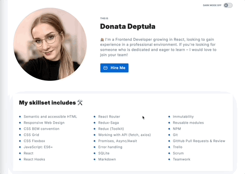

# 👩‍💻 Personal Homepage

This personal website serves as my portfolio, showcasing my skills, listing my future development plans, and providing an easy way to contact me. It displays links to my GitHub repositories and allows visitors to reach me via email and social media. The site also includes a dark mode theme switcher.

    
    

## 🌐 Demo

You can view the live version of the project here: [Personal Homepage](https://dondeptu.github.io/personal-homepage/)

## 💼 Features

- Lists personal skills and knowledge.

- Lists future development plans ("What I want to learn next").

- Displays my **GitHub repositories**.

- Provides an easy way to get in touch via email and social media.

- Supports a **dark mode theme** switcher.

- The loading spinner is displayed while data is being **fetched from the API**.

- Error handling for API failures.

- Responsive Design for both **desktop and mobile devices**.

## 🖥️ Technologies Used

- **Frontend**:

  - JavaScript (ES6+),

  - React

- **Styling**:

  - Styled Components,

  - Normalize CSS,

  - GlobalStyle,

  - Theme

- **Layout Structure**:

  - Grid-based and flexbox-based layout for responsive design

- **State Management**:

  - Redux,

  - Redux Toolkit,

  - Redux Saga

- **React Hooks**:

  - useEffect

- **Local Storage**:

  - Stores the **theme** preferences

- **CSS Naming Conventions**:

  - Follows the **BEM methodology** for naming files.

- **Design**:

  - UI based on a design provided in **Figma**.

## 🚀 Getting Started with Create React App

This project was bootstrapped with [Create React App](https://github.com/facebook/create-react-app).

### Available Scripts

In the project directory, you can run:

#### `npm start`

Runs the app in the development mode.\
Open [http://localhost:3000](http://localhost:3000) to view it in your browser.

The page will reload when you make changes.\
You may also see any lint errors in the console.

#### `npm run build`

Builds the app for production to the `build` folder.\
It correctly bundles React in production mode and optimizes the build for the best performance.

The build is minified and the filenames include the hashes.\
Your app is ready to be deployed!

See the section about [deployment](https://facebook.github.io/create-react-app/docs/deployment) for more information.

#### `npm run eject`

**Note: this is a one-way operation. Once you `eject`, you can't go back!**

If you aren't satisfied with the build tool and configuration choices, you can `eject` at any time. This command will remove the single build dependency from your project.

Instead, it will copy all the configuration files and the transitive dependencies (webpack, Babel, ESLint, etc) right into your project so you have full control over them. All of the commands except `eject` will still work, but they will point to the copied scripts so you can tweak them. At this point you're on your own.

You don't have to ever use `eject`. The curated feature set is suitable for small and middle deployments, and you shouldn't feel obligated to use this feature. However we understand that this tool wouldn't be useful if you couldn't customize it when you are ready for it.
